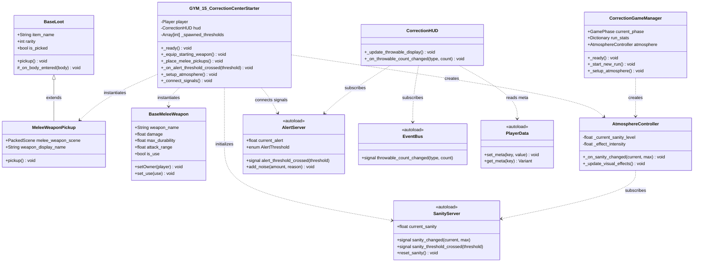
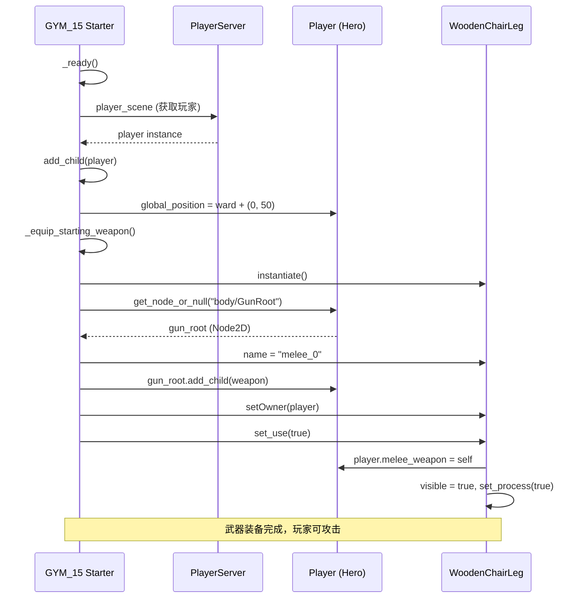
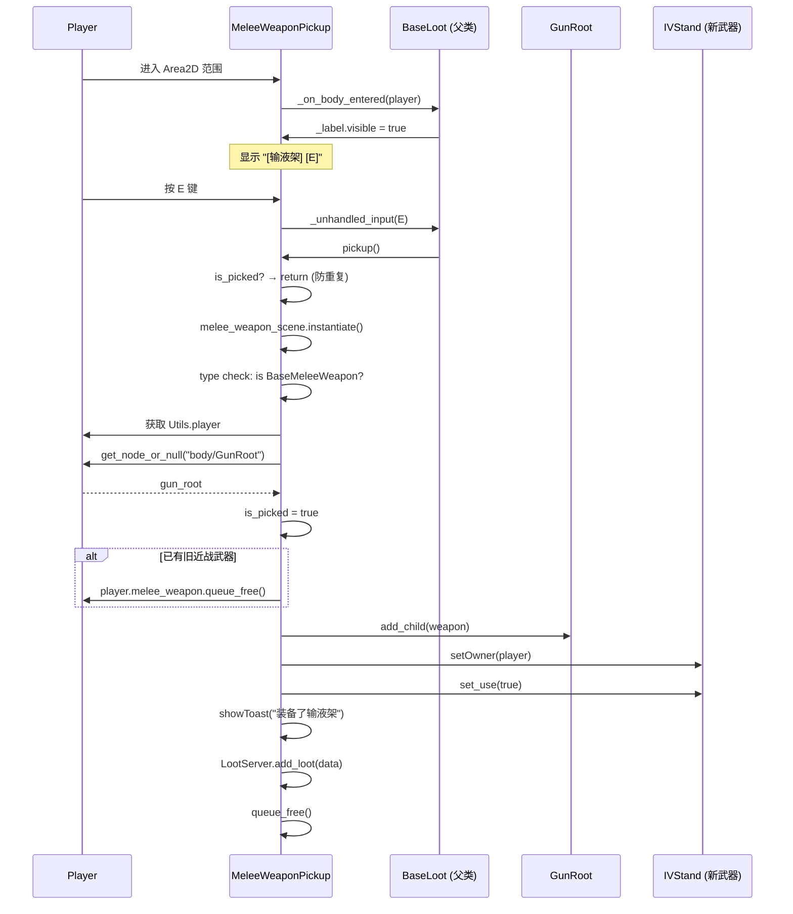
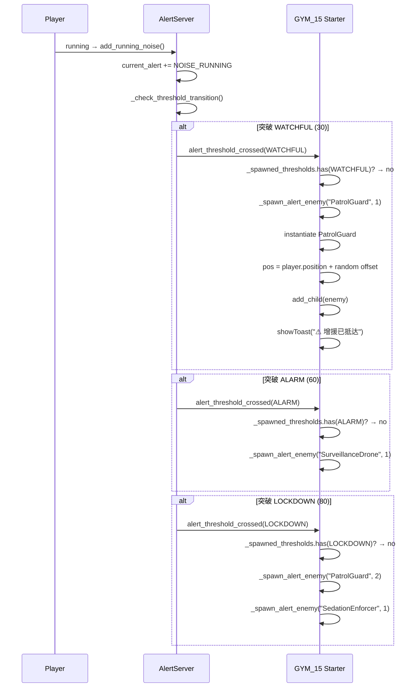
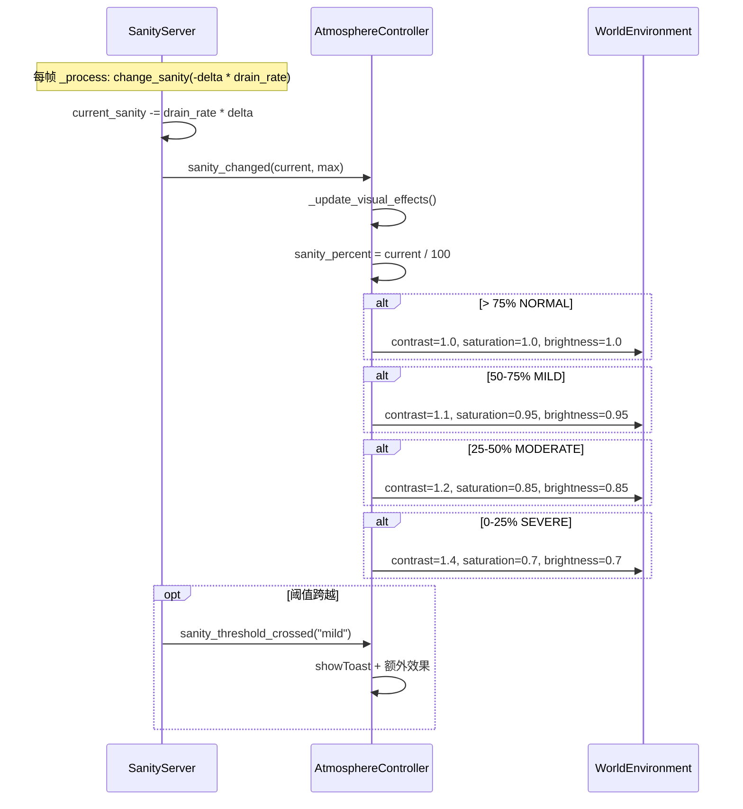

# 精神矫正中心 V2 — 架构设计文档

> 作者：高见远（架构师）  
> 日期：2026-06-08  
> 状态：基于 V1 增量，文档化已有实现并规划补齐项

---

## 目录

1. [实现方案与框架选型](#1-实现方案与框架选型)
2. [现状审计：已有实现](#2-现状审计已有实现)
3. [文件结构](#3-文件结构)
4. [数据结构与接口](#4-数据结构与接口)
5. [程序调用流程](#5-程序调用流程)
6. [任务列表](#6-任务列表)
7. [依赖包列表](#7-依赖包列表)
8. [共享知识](#8-共享知识)
9. [待明确事项](#9-待明确事项)

---

## 1. 实现方案与框架选型

### 1.1 技术栈

- **引擎**：Godot 4.x（`Engine.get_version_info()`）
- **语言**：GDScript
- **无外部依赖**：全部使用 Godot 内置 API 和项目已有系统

### 1.2 核心决策

| 决策 | 选择 | 理由 |
|------|------|------|
| 警戒值联动位置 | `GYM_15_CorrectionCenterStarter` | 场景脚本负责"本场景的游戏规则"，`CorrectionGameManager` 负责"跨场景的状态管理"。警戒值生成敌人是**场景特定规则**（不同阶段/场景生成不同敌人），而非通用逻辑 |
| 理智视觉反馈位置 | `AtmosphereController`（组件） | 已有独立 `AtmosphereController` 类，通过信号驱动。`GYM_15` Starter 中 `_setup_atmosphere()` 已实例化它。`CorrectionGameManager` 如果需要跨场景统一管理气氛，可额外实例化，但当前场景由 Starter 管控更直接 |
| 起始武器实现 | Starter 的 `_equip_starting_weapon()` | 与 GYM_12 模式一致：场景脚本在 `_ready()` 中实例化武器并通过 `setOwner`/`set_use` 装备 |
| MeleeWeaponPickup | 继承 `BaseLoot`，自定义 `pickup()` | 复用现有拾取框架。`BaseLoot` 提供 `_on_body_entered`、按 E 拾取、`is_picked` 防重复等基础逻辑 |
| 投掷物 HUD | `CorrectionHUD` 监听 `EventBus.throwable_count_changed` | 通过事件总线解耦。任何系统改变投掷物数量时 emit 信号，HUD 自动更新 |

### 1.3 架构分层

```
┌─────────────────────────────────────────┐
│  场景层 (Scene Layer)                      │
│  GYM_15_CorrectionCenterStarter          │
│  ├── 管理游戏生命周期                       │
│  ├── 动态实例化所有实体                      │
│  └── 连接场景特定信号                       │
├─────────────────────────────────────────┤
│  游戏玩法层 (Gameplay Layer)                │
│  ├── BaseMeleeWeapon (game/melee/)        │
│  ├── MeleeWeaponPickup (game/correction/) │
│  ├── AtmosphereController (game/atmosphere/)│
│  └── 各类敌人 (game/correction/enemies/)   │
├─────────────────────────────────────────┤
│  服务层 (Service Layer / Autoload)         │
│  ├── AlertServer (警戒值)                   │
│  ├── SanityServer (理智值)                  │
│  ├── PlayerData (玩家数据)                  │
│  ├── PlayerServer (玩家工厂)                │
│  ├── EventBus (事件总线)                    │
│  └── LootServer (战利品)                    │
└─────────────────────────────────────────┘
```

---

## 2. 现状审计：已有实现

在对现有代码全面审计后，PRD 中描述的 P0/P1 功能实际状况如下：

### 2.1 已完整实现的功能

| PRD 编号 | 功能 | 实现位置 | 状态 |
|----------|------|---------|------|
| P0-1 | 起始武器 `_equip_starting_weapon()` | `GYM_15_CorrectionCenterStarter.gd:206-219` | ✅ 完成 |
| P0-2 | MeleeWeaponPickup 拾取物 | `game/correction/items/MeleeWeaponPickup.gd` | ✅ 完成 |
| P1-1 | 投掷物 HUD（石子/药瓶/餐盘） | `CorrectionHUD.gd:18,61-65` | ✅ 核心逻辑完成，可优化 |
| P1-2 | 场景 MeleeWeaponPickup 放置 | `GYM_15 Starter.gd:222-233` | ✅ 完成 |
| P1-3 | 警戒值联动（ALARM + LOCKDOWN） | `GYM_15 Starter.gd:245-255` | ⚠️ 缺 WATCHFUL |
| P1-4 | 理智视觉反馈 | `GYM_15 Starter.gd:238-240` + `AtmosphereController.gd` | ✅ Starter 中完成 |

### 2.2 需补齐的缺口

| 缺口 | 具体内容 | 优先级 |
|------|---------|--------|
| WATCHFUL 阈值处理 | `_on_alert_threshold_crossed` 未处理 `AlertThreshold.WATCHFUL`，需添加 spawn 1 PatrolGuard | 高 |
| CorrectionGameManager 气氛控制 | PRD 要求 `CorrectionGameManager` 接入 `AtmosphereController`。当前仅在 GYM_15 Starter 中实例化，`CorrectionGameManager` 中没有 | 中 |
| 投掷物 HUD 图标 | 当前 HUD 仅显示数字文本 (`xN`)，PRD 要求"图标+数字"。可扩展为带图标的布局 | 低（体验增强） |

---

## 3. 文件结构

```
demo/
  GYM_15_CorrectionCenterStarter.gd       [修改] 添加 WATCHFUL 阈值处理

game/correction/
  CorrectionGameManager.gd                [修改] 接入 AtmosphereController
  items/
    MeleeWeaponPickup.gd                  [已有] 无需修改，已完成
  ui/
    CorrectionHUD.gd                      [已有] 核心逻辑完成，可选图标优化

game/atmosphere/
  AtmosphereController.gd                 [已有] 无需修改

game/melee/
  BaseMeleeWeapon.gd                      [已有] 无需修改
  WoodenChairLeg.tscn                     [已有] 起始武器资源
  IVStand.tscn                            [已有] 输液架武器资源
  RestraintStrap.tscn                     [已有] 约束带武器资源

game/loot/
  BaseLoot.gd                             [已有] 无需修改

autoload/
  AlertServer.gd                          [已有] 提供 alert_threshold_crossed 信号
  SanityServer.gd                         [已有] 提供 sanity_changed 信号
  PlayerData.gd                           [已有] 提供 stone_count/bottle_count/plate_count meta
  EventBus.gd                             [已有] 提供 throwable_count_changed 信号
```

### 操作汇总

| 文件 | 操作 | 说明 |
|------|------|------|
| `demo/GYM_15_CorrectionCenterStarter.gd` | **修改** | `_on_alert_threshold_crossed` 增加 WATCHFUL 分支 |
| `game/correction/CorrectionGameManager.gd` | **修改** | 添加 `_setup_atmosphere()` 和 `AtmosphereController` 实例化 |
| 其余文件 | **无操作** | 已有实现满足需求 |

---

## 4. 数据结构与接口

### 4.1 核心类关系图



### 4.2 关键接口说明

#### AlertServer.AlertThreshold 枚举（已有）

```gdscript
enum AlertThreshold {
    NORMAL,    # 0-30: 正常
    WATCHFUL,  # 30-60: 警惕 ← 当前未处理，需补齐
    ALARM,     # 60-80: 警报
    LOCKDOWN   # 80-100: 封锁
}
```

#### GYM_15 Starter 警戒值联动（需修改）

```gdscript
# 当前实现（GYM_15_CorrectionCenterStarter.gd:245-255）
# 缺少 WATCHFUL 分支
func _on_alert_threshold_crossed(threshold: AlertServer.AlertThreshold) -> void:
    if _spawned_thresholds.has(threshold):
        return
    _spawned_thresholds.append(threshold)
    match threshold:
        AlertServer.AlertThreshold.WATCHFUL:  # ← 需新增
            _spawn_alert_enemy("PatrolGuard", 1)
        AlertServer.AlertThreshold.ALARM:
            _spawn_alert_enemy("SurveillanceDrone", 1)
        AlertServer.AlertThreshold.LOCKDOWN:
            _spawn_alert_enemy("PatrolGuard", 2)
            _spawn_alert_enemy("SedationEnforcer", 1)
    Utils.showToast("⚠ 增援已抵达")
```

#### CorrectionGameManager 气氛控制（需新增）

```gdscript
# 在 CorrectionGameManager 中新增：
const ATMOSPHERE_CTRL := preload("res://game/atmosphere/AtmosphereController.gd")
var atmosphere: AtmosphereController

func _setup_atmosphere() -> void:
    atmosphere = ATMOSPHERE_CTRL.new()
    add_child(atmosphere)

# 在 _start_new_run() 末尾调用：
func _start_new_run() -> void:
    # ... 现有逻辑 ...
    if not is_instance_valid(atmosphere):
        _setup_atmosphere()
    current_phase = GamePhase.EXPLORATION
```

---

## 5. 程序调用流程

### 5.1 玩家出生 → 起始武器装备流程



### 5.2 玩家靠近 MeleeWeaponPickup → 拾取 → 武器装备流程



### 5.3 警戒值突破阈值 → 敌人生成流程



### 5.4 理智值变化 → 视觉反馈流程



---

## 6. 任务列表

按实现顺序排列，标注依赖关系和当前状态。

| ID | 任务 | 涉及文件 | 依赖 | 状态 | 说明 |
|----|------|---------|------|------|------|
| T1 | P0-1 起始武器 | `GYM_15_CorrectionCenterStarter.gd` | 无 | ✅ 已完成 | `_equip_starting_weapon()` 已实现（206-219行） |
| T2 | P0-2 MeleeWeaponPickup | `game/correction/items/MeleeWeaponPickup.gd` | 无 | ✅ 已完成 | 继承 BaseLoot，支持替换旧武器 |
| T3 | P1-2 场景物品补齐 | `GYM_15_CorrectionCenterStarter.gd` | T2 | ✅ 已完成 | `_place_melee_pickups()` 已放置输液架+约束带（222-233行） |
| T4 | P1-1 投掷物HUD | `CorrectionHUD.gd` | 无 | ⚠️ 核心完成 | 监听 `throwable_count_changed`，支持 stone/bottle/plate。可增强：添加图标 |
| T5 | P1-3 警戒值联动补齐 | `GYM_15_CorrectionCenterStarter.gd` | 无 | ❗ 待补齐 | 在 `_on_alert_threshold_crossed()` 中添加 `WATCHFUL` 分支，生成 1 个 PatrolGuard |
| T6 | P1-4 理智视觉接入 CM | `CorrectionGameManager.gd` | 无 | ❗ 待补齐 | 在 `CorrectionGameManager` 中添加 `_setup_atmosphere()`，实例化 `AtmosphereController` |

### 依赖关系图

```
T1 ✅ 完成 ──────────────────────────────┐
T2 ✅ 完成 ──→ T3 ✅ 完成                │
T4 ⚠️ 核心完成 (可并行)                   │
T5 ❗ 待补齐 ─────────────────────────────┤ (全部独立)
T6 ❗ 待补齐 ─────────────────────────────┘
```

### 工作估算

| 任务 | 工作量 | 说明 |
|------|--------|------|
| T5 | 极小（< 5 行代码） | 在已有 match 语句中添加一个 WATCHFUL 分支 |
| T6 | 小（~20 行代码） | 添加 const、字段、`_setup_atmosphere()` 方法，在 `_start_new_run()` 中调用 |
| T4 增强 | 小 | 如需图标优化，需修改 HUD 场景布局 |

---

## 7. 依赖包列表

无外部依赖。全部使用：

- **Godot 4.x 内置 API**：`Area2D`, `Node2D`, `CanvasLayer`, `WorldEnvironment`, `PackedScene`
- **项目已有系统**：`AlertServer`, `SanityServer`, `EventBus`, `PlayerData`, `LootServer`, `BaseLoot`, `BaseMeleeWeapon`

---

## 8. 共享知识

### 8.1 跨文件约定

#### 信号命名规范

| 模式 | 示例 | 说明 |
|------|------|------|
| `XxxServer.signal_name` | `AlertServer.alert_threshold_crossed` | 单例服务发出的信号 |
| `EventBus.signal_name` | `EventBus.throwable_count_changed` | 全局事件通过总线分发 |
| `PlayerData.onXxxChange` | `PlayerData.onHpChange` | 玩家数据变化的回调信号 |

#### 数据读写方式

```gdscript
# 投掷物计数 → 使用 PlayerData.set_meta/get_meta（键值对）
PlayerData.set_meta("stone_count", 5)
var count = PlayerData.get_meta("stone_count")

# 武器数据 → 使用 PlayerData 的属性
PlayerData.player_hp = 5
PlayerData.add_weapon(gun_instance)

# 通知 HUD → 通过 EventBus 发送
EventBus.throwable_count_changed.emit("stone", new_count)
```

#### 装备接口标准

```gdscript
# 近战武器装备的标准流程（参考 GYM_12 和 GYM_15 已实现模式）
1. weapon = SCENE.instantiate()
2. gun_root = player.get_node_or_null("body/GunRoot")  # 优先
3. gun_root = player.get_node_or_null("gun_root")       # fallback
4. gun_root.add_child(weapon)
5. weapon.setOwner(player)
6. weapon.set_use(true)  # 内部会设置 player.melee_weapon = self
```

### 8.2 注意事项

1. **`setOwner(player)` 必须在 `add_child` 之后调用**  
   `setOwner` 设置 `self.player` 引用，`set_use(true)` 内部依赖 `self.player` 以设置 `player.melee_weapon`。顺序错误会导致武器不响应输入。

2. **`gun_root` 路径有优先级**  
   玩家节点的 WeaponRoot 可能是 `body/GunRoot` 或 `gun_root`，需要 fallback 查找。

3. **`_spawned_thresholds` 数组防止重复生成**  
   每个阈值只应触发一次敌人生成。当前的 `Array[int]` 防重机制已经正确实现，添加 WATCHFUL 时无需额外处理。

4. **`AtmosphereController._exit_tree()` 自动清理信号**  
   该类已在 `_exit_tree()` 中断开与 `SanityServer` 的信号连接，无需在 `CorrectionGameManager` 中额外清理。

5. **不使用 `MOUSE_MODE_CONFINED_HIDDEN`**  
   项目规范要求使用 `MOUSE_MODE_HIDDEN`（见 CLAUDE.md）。UI 打开时切换为 `MOUSE_MODE_VISIBLE`。

---

## 9. 待明确事项

| ID | 问题 | 影响 | 建议 |
|----|------|------|------|
| Q1 | `CorrectionGameManager` 是否需要气氛控制？ | PRD 要求 CM 中接入 AtmosphereController，但当前 GYM_15 Starter 已独立实例化。两处是否冲突？ | 建议 CM 作为**独立运行**时的气氛入口，GYM_15 Starter 中的 `_setup_atmosphere()` 保持不变。CM 在 `_process` 中通过 `_is_cm_controlled` 标记区分 |
| Q2 | HUD 投掷物图标设计 | 当前仅显示 `xN` 数字，PRD 要求"图标+数字"。图标资源是否已有？ | 可先保持文本显示，图标化作为后续 UX 优化 |
| Q3 | AlertServer.WATCHFUL 的正确阈值 | 当前 `AlertServer._get_threshold_for_value()` 中 WATCHFUL 阈值为 `value >= 30.0`，但 `AlertThreshold` 枚举注释为 `30-60`。`alert_threshold_crossed` 信号在阈值变化时触发一次 | 代码枚举注释与实现一致，无需修改 |
| Q4 | `_spawn_alert_enemy` 使用硬编码路径 | 当前用 `"res://game/correction/enemies/%s.tscn" % enemy_type` 加载，缺少资源不存在时的降级处理 | 已有 `ResourceLoader.exists()` 检查（260行），但匹配的是完整路径，需确保与枚举名大小写一致 |
| Q5 | GYM_15 Starter 与 CorrectionGameManager 的关系 | Starter 中已连接 `AlertServer.alert_threshold_crossed`，CM 中也无此逻辑。当前架构合理 | 保持现状。Starter 负责场景规则，CM 负责全局状态 |

---

## 附录：现有代码完整性检查清单

| 检查项 | 文件 | 行号 | 状态 |
|--------|------|------|------|
| 起始武器装备 | `GYM_15 Starter.gd` | 206-219 | ✅ |
| MeleeWeaponPickup 类 | `game/correction/items/MeleeWeaponPickup.gd` | 1-75 | ✅ |
| Pickup 场景放置 | `GYM_15 Starter.gd` | 222-233 | ✅ |
| 投掷物 HUD 信号连接 | `CorrectionHUD.gd` | 18 | ✅ |
| 投掷物 HUD 更新方法 | `CorrectionHUD.gd` | 51-65 | ✅ |
| 警戒值信号连接 | `GYM_15 Starter.gd` | 201 | ✅ |
| 警戒值 ALARM 处理 | `GYM_15 Starter.gd` | 250-251 | ✅ |
| 警戒值 LOCKDOWN 处理 | `GYM_15 Starter.gd` | 252-254 | ✅ |
| **警戒值 WATCHFUL 处理** | `GYM_15 Starter.gd` | — | ❌ 缺失 |
| 气氛控制器实例化 | `GYM_15 Starter.gd` | 238-240 | ✅ |
| CM 中气氛控制 | `CorrectionGameManager.gd` | — | ❌ 缺失 |
