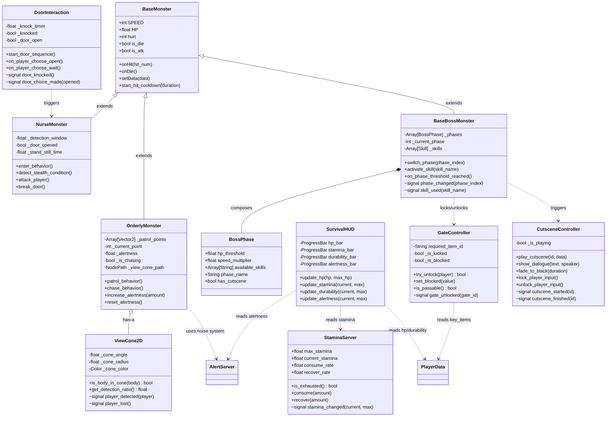
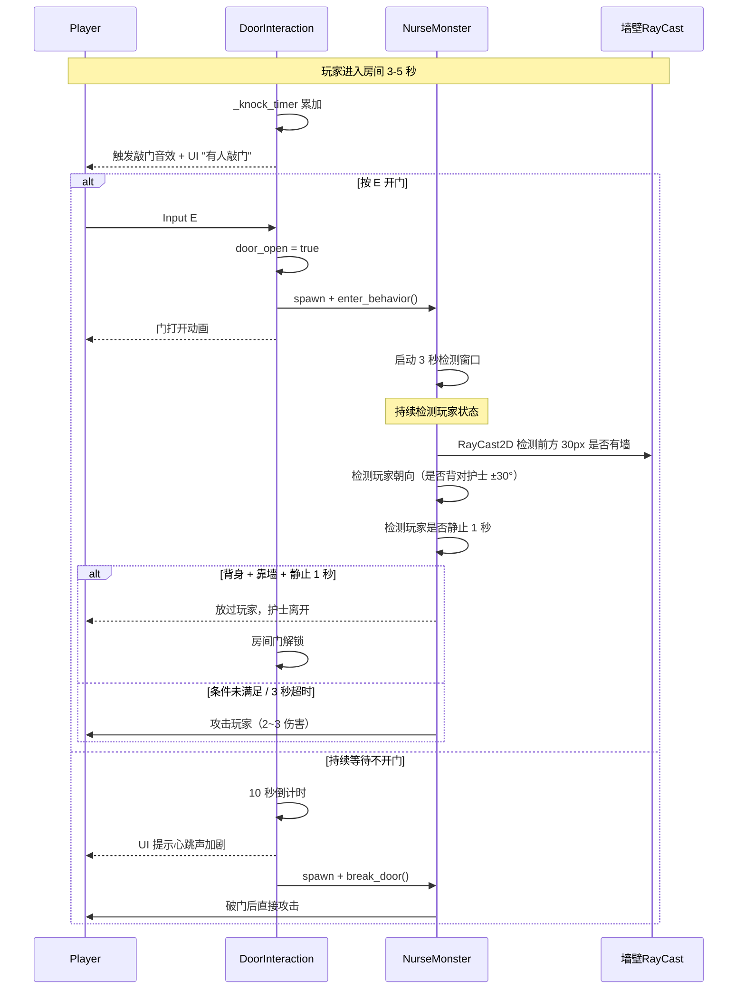
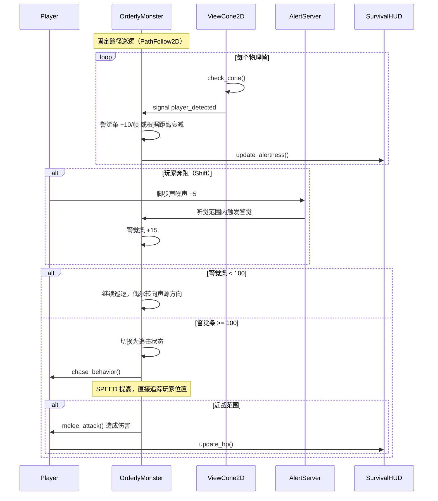
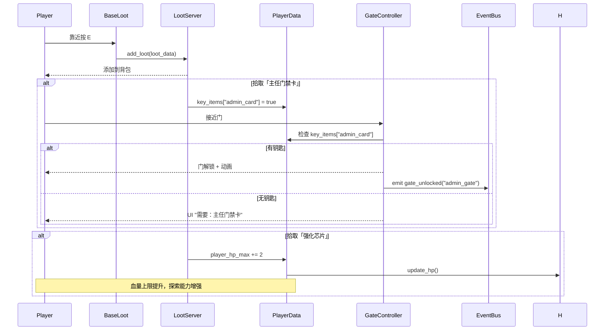
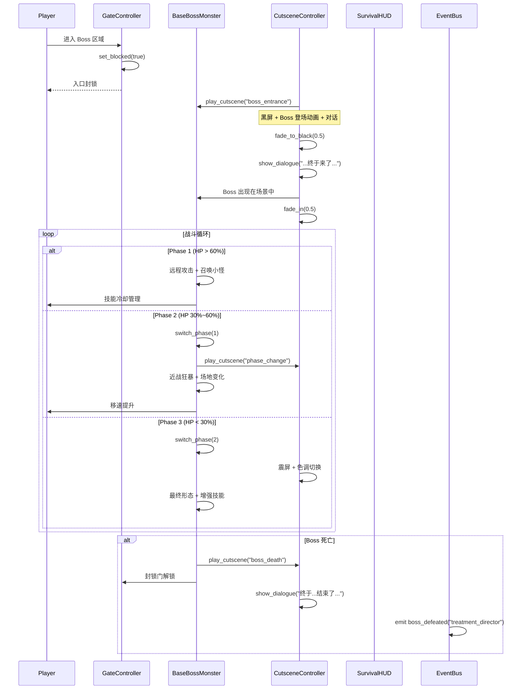

# 矫正生存 - 系统架构与任务分解

> 架构师：高见远
> 基于 PRD v1，覆盖 P0 需求（4 模块 ≈ 14 文件）

---

## 1. 实现方案

### 1.1 文件结构

```
game/
├── correction-survival/              # 新目录：本游戏专属（与 game/correction/ 隔离）
│   ├── interaction/
│   │   ├── DoorInteraction.gd        # 敲门触发 → 开门/不开门选择
│   │   └── DoorInteraction.tscn      # 配套场景（UI 提示 + 碰撞区域）
│   ├── enemies/
│   │   ├── NurseMonster.gd           # 护士 AI（继承 BaseMonster）
│   │   ├── NurseMonster.tscn         # 护士场景（碰撞/动画节点）
│   │   ├── OrderlyMonster.gd         # 监护巡逻 AI（继承 BaseMonster）
│   │   ├── OrderlyMonster.tscn       # 监护场景
│   │   └── ViewCone2D.gd             # 视觉锥组件（Area2D，可配置角度/半径）
│   ├── boss/
│   │   ├── BaseBossMonster.gd        # Boss 基类（继承 BaseMonster）
│   │   └── BossPhase.gd              # 阶段状态组件
│   ├── gate/
│   │   └── GateController.gd         # 门/节点解锁 + 封锁
│   └── ui/
│       ├── SurvivalHUD.gd            # 生存 HUD 逻辑
│       └── SurvivalHUD.tscn          # HUD 场景（血条/体力/耐久/警觉）

autoload/
├── PlayerData.gd                     # [改造] +stamina/alertness/key_items/game_flags
├── EventBus.gd                       # [改造] +新信号
├── StaminaServer.gd                  # [新增] 体力管理 autoload
├── CutsceneController.gd             # [新增] 过场控制器 autoload
└── server/
    └── AlertServer.gd                # [复用] 已有警觉度系统，无需改动

demo/
├── GYM_16_CorrectionSurvival.tscn    # MVP 验证场景
└── GYM_16_CorrectionSurvivalStarter.gd  # 启动脚本
```

### 1.2 复用/改造/新建清单

| 类别 | 文件 | 操作 | 原因 |
|------|------|------|------|
| **复用** | `autoload/server/AlertServer.gd` | 现成可用 | 已有完整的警觉阈值/衰减/噪声系统，语义也匹配 |
| **复用** | `game/monster/BaseMonster.gd` | 现成可用 | HP/追击/受击闪白/死亡流程/击退，子类扩展行为即可 |
| **复用** | `game/melee/BaseMeleeWeapon.gd` | 现成可用 | 攻击 hitbox/耐久度/冷却，仅需调低初始 max_durability |
| **复用** | `game/loot/BaseLoot.gd` | 现成可用 | E 键拾取 + Label 提示 + LootServer 集成 |
| **复用** | `autoload/server/LootServer.gd` | 现成可用 | 背包管理/12 格上限，无需改动 |
| **复用** | `game/hero/Hero.gd` | 现成可用 | 移动/冲刺/朝向/受击，P0 不改动 |
| **复用** | `autoload/EventBus.gd` | 现成可用 | 已有信号继续使用，P0 仅追加新信号 |
| **改造** | `autoload/PlayerData.gd` | +~50 行 | 新增 stamina/alertness/max_stamina/key_items/game_flags 字段 |
| **改造** | `autoload/EventBus.gd` | +~15 行 | 新增 gate_unlocked/cutscene_started/cutscene_finished/stamina_changed |
| **新增** | `game/.../DoorInteraction.gd/.tscn` | ~120 行 | 敲门触发器 + UI 选择窗口 |
| **新增** | `game/.../NurseMonster.gd/.tscn` | ~150 行 | 进入→3s 窗口→背身靠墙检测→攻击/破门 |
| **新增** | `game/.../OrderlyMonster.gd/.tscn` | ~200 行 | 固定路径巡逻 + 视觉锥 + 听觉 + 警觉条→追击 |
| **新增** | `game/.../ViewCone2D.gd` | ~80 行 | 扇形 Area2D 组件，配置角度/半径/颜色 |
| **新增** | `game/.../BaseBossMonster.gd` | ~250 行 | 阶段切换/技能系统/演出触发 |
| **新增** | `game/.../BossPhase.gd` | ~60 行 | 阶段状态资源 |
| **新增** | `game/.../GateController.gd` | ~80 行 | 关键道具检查 + 状态持久化 + 封锁 |
| **新增** | `autoload/StaminaServer.gd` | ~80 行 | 体力消耗/恢复/上限 |
| **新增** | `autoload/CutsceneController.gd` | ~150 行 | 过场动画控制器 |
| **新增** | `game/.../SurvivalHUD.gd/.tscn` | ~100 行 | 血条/体力/耐久/警觉度显示 |
| **新增** | `demo/GYM_16_*.gd/.tscn` | ~100 行 | MVP 验证场景 |

> **注**：与 `game/correction/`（v1/v2 精神矫正中心）完全隔离，不共用场景结构和文件。

### 1.3 架构分层

```
┌─────────────────────────────────────────────────────────┐
│                      UI Layer                           │
│  SurvivalHUD (血量/体力/耐久/警觉度)                     │
├─────────────────────────────────────────────────────────┤
│                   Game Object Layer                     │
│  DoorInteraction  NurseMonster  OrderlyMonster          │
│  ViewCone2D       BaseBossMonster  GateController       │
│  BossPhase        BaseLoot (复用)  BaseMeleeWeapon(复用) │
├────────────────────────┬────────────────────────────────┤
│    Autoload Layer      │     Shared Components          │
│  EventBus (改造)       │  Hero.gd (复用)                │
│  PlayerData (改造)     │  BaseMonster.gd (复用)         │
│  StaminaServer (新增)  │  Utils.gd (复用)               │
│  CutsceneController    │  Camera2D (复用)               │
│  AlertServer (复用)    │                               │
│  LootServer (复用)     │                               │
└────────────────────────┴────────────────────────────────┘
```

---

## 2. 任务列表

按实现顺序排列，严格标注依赖关系。

### 阶段 A：基础设施（所有模块的前置条件）

| ID | 模块 | 文件 | 依赖 | 预计工作量 | 说明 |
|-----|------|------|------|-----------|------|
| A-1 | 基建 | `autoload/PlayerData.gd` | 无 | ~50 行改造 | 新增 stamina/max_stamina/alertness/key_items/game_flags 字段，每个带 setter 发出信号 |
| A-2 | 基建 | `autoload/EventBus.gd` | A-1 | ~15 行 | `stamina_changed(当前,最大值)` `gate_unlocked(gate_id)` `cutscene_started(id)` `cutscene_finished(id)` `door_knocked` `door_choice_made(opened:bool)` |
| A-3 | 基建 | `autoload/StaminaServer.gd` | A-1 | ~80 行新文件 | 体力最大值/当前值/消耗速率/恢复速率，跑步消耗/站立恢复，为 0 时不能冲刺 |

### 阶段 B：房间醒来（模块 A）

| ID | 模块 | 文件 | 依赖 | 预计工作量 | 说明 |
|-----|------|------|------|-----------|------|
| B-1 | 房间 | `game/correction-survival/interaction/DoorInteraction.gd` | A-2 | ~120 行 | Area2D 检测玩家在房间 3-5s 后敲门 → 弹出选择 UI（按 E 开门/等待不开门）→ 发信号 |
| B-2 | 房间 | `game/correction-survival/interaction/DoorInteraction.tscn` | B-1 | 场景配置 | Area2D + CollisionShape2D + Label 子节点 |
| B-3 | 房间 | `game/correction-survival/enemies/NurseMonster.gd` | A-2, B-1 | ~150 行 | 继承 BaseMonster。开门线：进入→启动 3s 倒计时→检测玩家背身+靠墙+静止→攻击/放过；不开门线：10s 破门→攻击。使用 RayCast2D 检测墙壁 |
| B-4 | 房间 | `game/correction-survival/enemies/NurseMonster.tscn` | B-3 | 场景配置 | CollisionShape2D + body/AnimatedSprite2D + RayCast2D 节点 + 音效 |
| B-5 | 房间 | 场景内布置物资 | B-3 | ~20 行 | 房间内放绷带+初始武器（复用 BaseLoot），玩家存活后门解锁通向走廊 |

### 阶段 C：走廊潜行（模块 B）

| ID | 模块 | 文件 | 依赖 | 预计工作量 | 说明 |
|-----|------|------|------|-----------|------|
| C-1 | 潜行 | `game/correction-survival/enemies/ViewCone2D.gd` | 无 | ~80 行 | Area2D 子节点，用 CollisionPolygon2D 画扇形（配置半径/角度），含 `body_in_cone(player) → bool` + 信号 `player_detected` `player_lost` |
| C-2 | 潜行 | `game/correction-survival/enemies/OrderlyMonster.gd` | A-2, C-1 | ~200 行 | 继承 BaseMonster。固定路径巡逻（Path2D + PathFollow2D 或路径点数组）→ 视觉锥 + 听觉检测（AlertServer 噪声）→ 警觉条积累 → 满后追击攻击。攻击力适中 |
| C-3 | 潜行 | `game/correction-survival/enemies/OrderlyMonster.tscn` | C-2 | 场景配置 | CollisionShape2D + body/AnimatedSprite2D + ViewCone2D 子节点 |
| C-4 | 潜行 | `game/correction-survival/ui/SurvivalHUD.gd` | A-1, A-3, 现有 AlertServer | ~100 行 | CanvasLayer 根节点，4 个进度条：血条（PlayerData.player_hp）、体力条（StaminaServer）、耐久（PlayerData.onMeleeDurabilityChange）、警觉（AlertServer.alert_changed） |
| C-5 | 潜行 | `game/correction-survival/ui/SurvivalHUD.tscn` | C-4 | 场景配置 | CanvasLayer + 4 个 VBoxContainer 含 ProgressBar + Label |

### 阶段 D：搜刮升级（模块 C）

| ID | 模块 | 文件 | 依赖 | 预计工作量 | 说明 |
|-----|------|------|------|-----------|------|
| D-1 | 升级 | `game/correction-survival/gate/GateController.gd` | A-2 | ~80 行 | Area2D 检测玩家持有 `key_item` → 解锁门。支持两种模式：`UNLOCK`（需要关键道具）和 `BLOCK`（封锁不可通过） |
| D-2 | 升级 | PlayerData 升级循环微调 | A-1, D-1 | ~20 行 | 搜刮"强化芯片/医疗记录"等触发 PlayerData 属性变更（血量上限/体力上限/移速） |
| D-3 | 升级 | 场景内 Gate 布置 | D-1 | 关卡配置 | 在走廊关键路径放置 GateController，配置所需 key_item |

### 阶段 E：Boss + 封锁（模块 D）

| ID | 模块 | 文件 | 依赖 | 预计工作量 | 说明 |
|-----|------|------|------|-----------|------|
| E-1 | Boss | `game/correction-survival/boss/BossPhase.gd` | 无 | ~60 行 | Resource 或 Node，存储阶段数据：HP 阈值、技能列表、移动速度、演出触发信号 |
| E-2 | Boss | `game/correction-survival/boss/BaseBossMonster.gd` | A-2, E-1 | ~250 行 | 继承 BaseMonster。阶段切换逻辑（HP 百分比触发）、技能系统（技能数组+冷却+当前阶段可用技能）、演出触发（登场/阶段切换/死亡）。预留子类扩展点 |
| E-3 | 演出 | `autoload/CutsceneController.gd` | A-2 | ~150 行 | 过场管理器。支持：黑屏过渡、对话文本显示、摄像机锁定、动画播放。提供 `play_cutscene(id, data)` 接口。Boss 入场/阶段切换/结局复用 |
| E-4 | 封锁 | GateController 封锁模式 | D-1, E-2 | ~30 行改造 | GateController 增加 `BLOCK` 状态和 `is_blocked` 检查。Boss 战触发时封锁入口，Boss 死亡后解锁 |

### 阶段 F：MVP 验证场景

| ID | 模块 | 文件 | 依赖 | 预计工作量 | 说明 |
|-----|------|------|------|-----------|------|
| F-1 | 验证 | `demo/GYM_16_CorrectionSurvival.tscn` | B-1~B-5, C-1~C-5, D-1~D-3, E-1~E-4 | 场景搭建 | TileMap + 房间区 + 走廊区 + 封锁门 + Boss 区 |
| F-2 | 验证 | `demo/GYM_16_CorrectionSurvivalStarter.gd` | 全部 | ~100 行 | 加载 Hero → 初始化 PlayerData → 初始化 StaminaServer → 布局 DoorInteraction → 布局 Orderly + ViewCone → 布局 Gate → 布局 Boss → 初始化 HUD → 注册 AlertServer → Utils.gameStart() |

---

### 依赖图（DAG）

```
A-1 PlayerData  ──→ A-2 EventBus ──→ A-3 StaminaServer
                                       │
B-1 DoorInteraction ──→ B-3 NurseMonster
├─ B-2 DoorScene                        │
C-1 ViewCone2D ──→ C-2 OrderlyMonster  └── B-4 NurseScene
C-4 SurvivalHUD                              │
│                                             │
D-1 GateController ──→ D-2 PlayerData微调    │
│                       D-3 场景布置          │
E-1 BossPhase ──→ E-2 BaseBossMonster        │
                    E-4 Gate封锁模式          │
E-3 CutsceneController                       │
                                              ▼
                      F-1 GYM_16.tscn ←── F-2 GYM_16_Starter
```

---

## 3. Mermaid 图

### 3.1 类图



### 3.2 时序图

#### 流程 1：开门/醒来



#### 流程 2：走廊潜行



#### 流程 3：搜刮升级



#### 流程 4：Boss 战



---

## 4. 共享知识

### 4.1 跨文件约定

| 约定 | 内容 |
|------|------|
| **目录隔离** | 所有新文件放 `game/correction-survival/` 下，不与 `game/correction/`（v1/v2 精神矫正中心）混淆 |
| **场景命名** | GYM_16_CorrectionSurvival，TSEN 文件与 GD 文件同名同目录 |
| **根节点类型** | 所有启动场景使用 `Node2D` 作为根节点 |
| **类名模式** | 沿用 `class_name` 声明以便类型检查，例如 `class_name NurseMonster` |
| **物理检测** | 背身靠墙检测使用 RayCast2D（非杂乱碰撞检测），视觉锥使用 Area2D + CollisionPolygon2D |
| **路径** | 巡逻路径使用 Path2D + PathFollow2D 子节点，路径点通过编辑器配置 |
| **警觉度系统** | 已有 `AlertServer` 用于 阶段2/4 的警觉度UI 和噪声检测，不新建方案 |
| **Autoload 注册** | 新增 StaminaServer/CutsceneController 需在 `project.godot` 的 `[autoload]` 段注册 |

### 4.2 信号命名规范

```
# 格式：<作用域>_<动作>[_<附加信息>]

# PlayerData 新增字段信号（沿用已有命名风格）
signal stamina_changed(current: float, max: float)         # A-1
signal key_item_acquired(item_id: String)                   # A-1（EventBus已有同名，PlayerData也发一份）
signal game_flag_set(flag_name: String, value)              # A-1

# EventBus 新增信号
signal gate_unlocked(gate_id: String)                      # A-2
signal gate_blocked(gate_id: String)                       # A-2
signal cutscene_started(cutscene_id: String)               # A-2
signal cutscene_finished(cutscene_id: String)              # A-2
signal door_knocked()                                      # A-2
signal door_choice_made(opened: bool)                      # A-2

# ViewCone2D 本地信号（非 EventBus）
signal player_detected(player: Node2D)                     # C-1
signal player_lost()                                       # C-1

# BaseBossMonster 本地信号
signal phase_changed(phase_index: int)                     # E-2
signal skill_used(skill_name: String)                      # E-2（EventBus 已有的 boss_skill_used 配合使用）

# GateController 本地信号
signal gate_unlocked(gate_id: String)                      # D-1（也会发 EventBus 版本）
signal gate_blocked(gate_id: String)                       # D-1
```

### 4.3 数据读写方式

| 数据类型 | 存储位置 | 读写方式 | 说明 |
|----------|---------|---------|------|
| **血量/等级/经验** | PlayerData | `PlayerData.player_hp` / `PlayerData.player_hp_max` | 已带有 setter 发信号 |
| **体力** | StaminaServer | `StaminaServer.current_stamina` + `.consume()`/`.recover()` | 新增 autoload |
| **警觉度** | AlertServer | `AlertServer.current_alert` + `.add_noise()` | 已存在，直接使用 |
| **武器耐久** | BaseMeleeWeapon | `weapon.current_durability` / `.max_durability` | 已存在，信号 `onMeleeDurabilityChange` |
| **关键道具** | PlayerData.key_items | `PlayerData.key_items["item_id"] = true` | Dictionary，在拾取时设置 |
| **游戏标记** | PlayerData.game_flags | `PlayerData.game_flags["flag_name"] = true` | Dictionary，任意布尔标记 |
| **背包物品** | LootServer | `LootServer.current_loot` + `.add_loot()`/`.remove_loot()` | 已存在，使用 Dictionary 数组 |
| **巡逻路径** | OrderlyMonster 场景节点 | `.get_node("Path2D").curve` | PathFollow2D + Curve2D，编辑器定义 |

### 4.4 关键注意事项

1. **AlertServer 已存在且可用**：不要从零重写警觉度系统。PRD 说"改造 SanityServer"是一个方向，但 `autoload/AlertServer.gd` 实际上已经实现了一个更好的版本（阈值枚举 + 衰减 + 噪声类型常量）。直接用。

2. **ViewCone2D 是组件而非节点**：设计为可挂载到任何敌人下的子节点（如 OrderlyMonster > ViewCone2D），通过信号通知宿主。不需要独立场景文件。

3. **BaseBossMonster 不引入新动画帧**：P0 阶段复用现有动画系统（`anim.sprite_frames`），阶段切换通过速度/攻击模式/颜色变化表达，而不是完整的新动画集。

4. **Hero.gd 不做 P0 改动**：蹲伏（crouch）和脚步噪音值属于 P2，不从 P0 就开始改 Hero.gd。P0 潜行通过 ViewCone 的检测逻辑控制，不需要 Hero 新增状态。

5. **耐久度限制**：初始近战武器设置 `max_durability = 30~50`（即只能攻击 2~3 个敌人），直接通过 `BaseMeleeWeapon` 的 `on_weapon_broken()` 处理。

6. **StaminaServer 轻量**：只需要 cur/max/consume/recover/is_exhausted 4 个核心接口，以及按秒衰减的 \_process 逻辑。不需要复杂的能量系统。

7. **GateController 双模式**：
   - `UNLOCK` 模式：检查 `key_items`，有钥匙解锁门（Module C 升级）
   - `BLOCK` 模式：锁定为不可通过，Boss 战开始自动激活（Module D 封锁）

8. **GYM_16 场景结构**：
   - 根节点 Node2D
   - 子节点：Player（Hero）、TileMap（房间+走廊+ Boss 室）、DoorInteraction、NurseMonster、OrderlyMonster ×2、ViewCone（挂载到 Orderly）、GateController ×2（走廊门+Boss 门）、BaseBossMonster、SurvivalHUD（CanvasLayer）、Loot 物品 ×3~5
   - Starter 脚本负责初始化所有 autoload 状态和摆放敌人/物品

---

## 5. 待明确事项

| # | 问题 | 影响范围 | 建议方案 |
|---|------|---------|---------|
| Q1 | **GYM_16 场景的 TileMap 复用哪一份？** 项目现有多个场景（SnowWorld/Town/Moon），是否有通用的病房/走廊 TileSet 可用，还是需要新建素材？ | F-1 场景搭建 | 建议使用现有 Town 或 SnowWorld 的 TileSet，色调解为暖黄/暗色调即可 |
| Q2 | **背身靠墙检测中"墙壁"的定义？** 是检测 TileMap 的 wall layer，还是任意 StaticBody2D 都算？ | B-3 NurseMonster | 建议 RayCast2D 检测 TileMap 中 `collision_layer = 1` 或指定 `wall` physics layer |
| Q3 | **初始近战武器的具体类型？** 使用现存的 WoodenChairLeg 还是新建 PrisonShank？ | 阶段 B 装备 | 建议直接用 `WoodenChairLeg.tscn`（已有），仅调低 `max_durability = 40` |
| Q4 | **生存 HUD 的 UI 风格？** 是直接复用 ControlUI 框架（已有）还是从零新建？ | C-4 SurvivalHUD | 建议新建 SurvivalHUD.tscn（CanvasLayer），不依赖已有 ControlUI，因为原 ControlUI 绑定了枪械/弹药 UI |
| Q5 | **Boss 阶段切换的"演出"需要动画场景还是纯代码切换？** P0 阶段是否允许简化为一瞬间的变换？ | E-2, E-3 | 建议 P0 阶段切换为纯代码（速度变化 + 颜色变化 + 震屏），CutsceneController 用于登场和死亡即可 |
| Q6 | **"固定路径巡逻"是 Path2D 还是硬编码路径点数组？** 哪种更适合未来的关卡编辑器修改？ | C-2 OrderlyMonster | 建议 Path2D + PathFollow2D 方式，路径可在编辑器拖拽，OrderlyMonster 从 PathFollow2D.offset 获取位置 |
