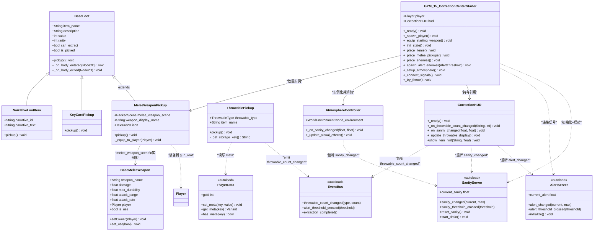
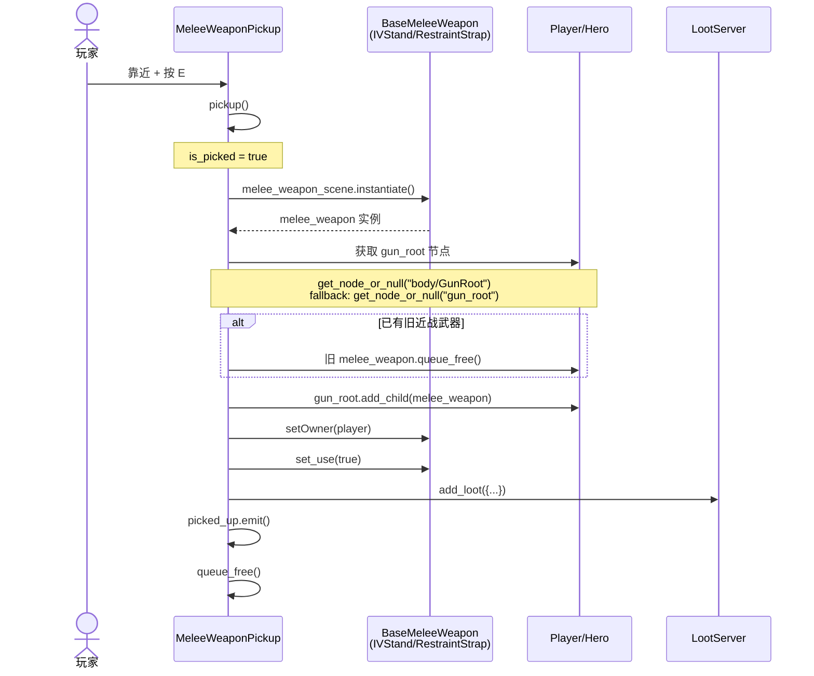
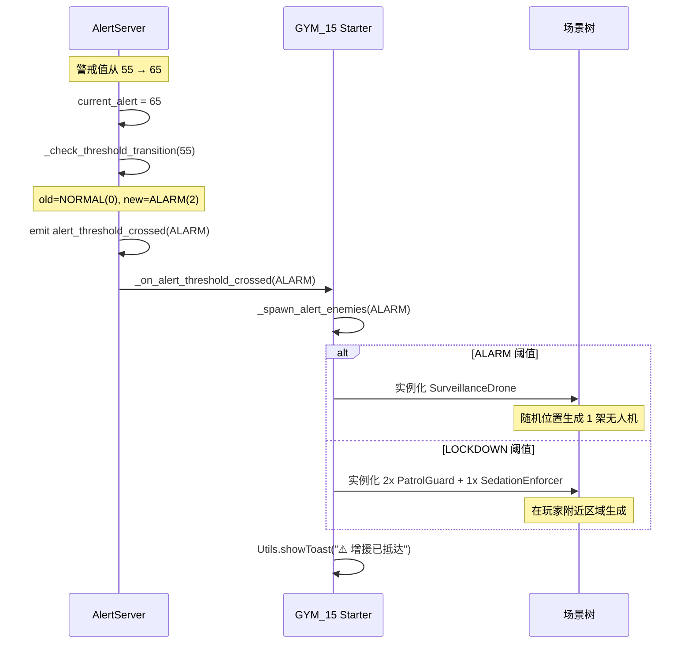
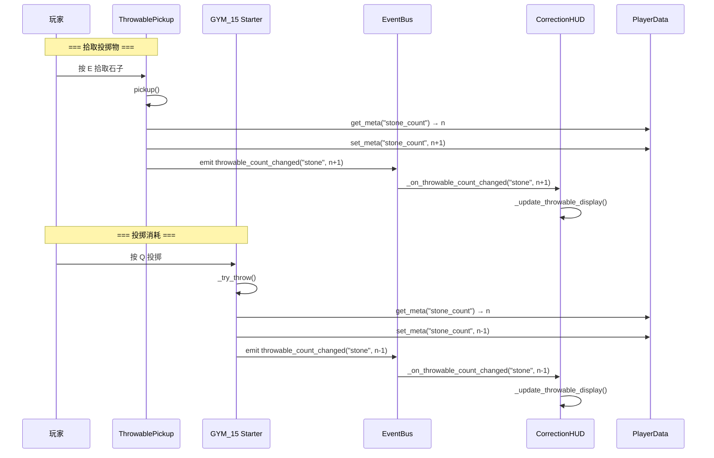
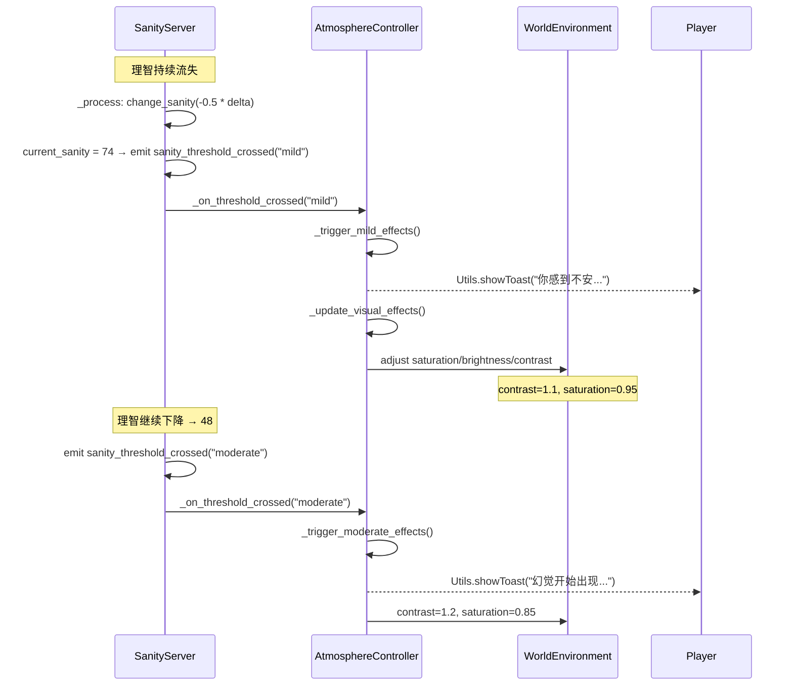
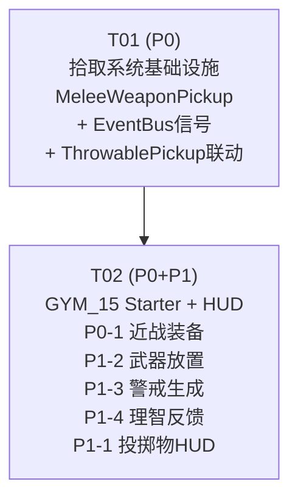

# 精神矫正中心 MVP 实现方案 & 任务分解

> **作者**: 高见远（Bob, Architect）
> **日期**: 2025-07-09
> **输入**: 增量 PRD — P0/P1 差距清单

---

## Part A: 系统设计

### 1. 实现方案

#### 技术约束分析

| 难点 | 分析 | 方案 |
|------|------|------|
| 近战武器不是 BaseLoot 子类，无法放入 LootServer | 近战武器是 Node2D → BaseMeleeWeapon，与 BaseLoot(Area2D) 完全不同 | 创建 MeleeWeaponPickup 包装类，extend BaseLoot，内部持有 PackedScene 引用 |
| 投掷物数量存储在 PlayerData meta，无变更通知 | HUD 无法被动感知数量变化 | 通过 EventBus 新增 `throwable_count_changed` 信号解耦 |
| 警戒阈值事件已有信号但场景未响应 | `alert_threshold_crossed` 信号已发射，GYM_15 未连接 | GYM_15 Starter 连接该信号，按阈值创建新敌人 |
| 理智系统存在但无视觉反馈 | SanityServer autoload 已就绪，AtmosphereController 在 GYM_11 已验证 | GYM_15 实例化 AtmosphereController 并启动理智流失 |

#### 架构模式

- **现有模式复用**: 不引入新架构，完全遵循现有 GYM_12（近战装备）、GYM_11（理智氛围）、BaseLoot 子类（拾取物）三套已验证模式
- **通信方式**: EventBus 信号（跨系统）+ 直接方法调用（场景内）

---

### 2. 文件列表

| # | 文件路径 | 操作 | 所属任务 | 说明 |
|---|----------|------|----------|------|
| 1 | `game/correction/items/MeleeWeaponPickup.gd` | **新增** | T01 | 近战武器地面拾取类，extend BaseLoot |
| 2 | `game/correction/items/MeleeWeaponPickup.tscn` | **新增** | T01 | 拾取物场景（Area2D + Sprite2D + Label + CollisionShape2D） |
| 3 | `autoload/EventBus.gd` | **修改** | T01 | 新增 `throwable_count_changed(type: String, count: int)` 信号 |
| 4 | `game/correction/items/ThrowablePickup.gd` | **修改** | T01 | pickup() 中 emit throwable_count_changed |
| 5 | `demo/GYM_15_CorrectionCenterStarter.gd` | **修改** | T02 | P0-1 装备近战 + P1-2 放置拾取 + P1-3 警戒生成 + P1-4 理智氛围 |
| 6 | `game/correction/ui/CorrectionHUD.gd` | **修改** | T02 | P1-1 投掷物余量显示 + 理智条 |
| 7 | `game/correction/ui/CorrectionHUD.tscn` | **修改** | T02 | 新增投掷物显示 Label + SanityBar 节点 |
| — | `game/melee/WoodenChairLeg.tscn` | 仅参考 | — | P0-1 起始近战武器 |
| — | `game/melee/IVStand.tscn` | 仅参考 | — | P1-2 场景拾取物 |
| — | `game/melee/RestraintStrap.tscn` | 仅参考 | — | P1-2 场景拾取物 |
| — | `game/atmosphere/AtmosphereController.gd` | 仅参考 | — | P1-4 理智视觉反馈 |
| — | `game/loot/BaseLoot.gd` | 仅参考 | — | 拾取基类 |

---

### 3. 数据结构与接口



---

### 4. 程序调用流程

#### 4.1 近战武器拾取流程（P0-2 核心路径）



#### 4.2 警戒阈值 → 敌人生成（P1-3）



#### 4.3 投掷物计数 → HUD 更新（P1-1）



#### 4.4 理智 → 氛围视觉反馈（P1-4）



---

### 5. 待明确事项

| # | 问题 | 当前假设 | 影响范围 |
|---|------|----------|----------|
| Q1 | Player 的 gun_root 节点路径是 `body/GunRoot` 还是 `gun_root`？ | 先用 `body/GunRoot`（与 GYM_12 一致），fallback `gun_root` | P0-1, P0-2 |
| Q2 | 警戒阈值触发敌人生成的冷却时间？ | 每个阈值级别仅触发一次（用 `_spawned_for_threshold` 集合追踪） | P1-3 |
| Q3 | LOCKDOWN 时生成多少额外敌人？ | 2 PatrolGuard + 1 SedationEnforcer，在玩家当前区域随机生成 | P1-3 |
| Q4 | SanityServer.start_drain() 在 GYM_15 是否应该调用？ | 是，P1-4 要求在 `_init_state()` 中添加 `start_drain()` | P1-4 |
| Q5 | 投掷物 HUD 是否显示所有三种类型（石子/药瓶/餐盘）还是仅石子？ | 显示全部三种，按"有库存才显示"原则，避免界面杂乱 | P1-1 |
| Q6 | IVStand / RestraintStrap 应放置在哪个区域？ | IVStand → 治疗区（treatment），RestraintStrap → 病房区（ward） | P1-2 |

---

## Part B: 任务分解

### 6. 依赖声明

本项目为 Godot 4.x 项目，无外部包依赖。所有功能使用引擎内置类和已有 autoload 系统。

```
- Godot Engine 4.x: 游戏引擎（已安装）
- 所有依赖均为项目内 autoload 和现有脚本
```

---

### 7. 任务列表（按依赖排序）

#### T01: 拾取系统基础设施（MeleeWeaponPickup + EventBus 信号 + ThrowablePickup 联动）

| 属性 | 内容 |
|------|------|
| **Task ID** | T01 |
| **优先级** | P0 |
| **依赖** | 无 |

**操作文件**:

| 文件 | 操作 | 具体内容 |
|------|------|----------|
| `game/correction/items/MeleeWeaponPickup.gd` | **新增** | 创建 extend BaseLoot 的拾取类。含 `melee_weapon_scene: PackedScene`、`weapon_display_name: String`。`pickup()` 中：实例化武器 → 获取 player 的 gun_root → 淘汰旧近战武器 → `add_child` + `setOwner` + `set_use(true)` → 添加到 LootServer → emit picked_up → queue_free |
| `game/correction/items/MeleeWeaponPickup.tscn` | **新增** | Area2D 场景，挂 MeleeWeaponPickup 脚本。含 Sprite2D（图标）、Label（`[E] 拾取`）、CollisionShape2D（圆形拾取范围 ~40px）。inherit BaseLoot 的 body_entered/E 键触发模式 |
| `autoload/EventBus.gd` | **修改** | 在"物品与战利品"段新增信号：`signal throwable_count_changed(throwable_type: String, count: int)` |
| `game/correction/items/ThrowablePickup.gd` | **修改** | 在 `pickup()` 方法的 `PlayerData.set_meta(key, current + 1)` 之后、`emit picked_up` 之前，新增一行：`EventBus.throwable_count_changed.emit(_get_type_string(), current + 1)`。新增辅助方法 `_get_type_string() → String` 返回 "stone"/"bottle"/"plate" |

**MeleeWeaponPickup 核心逻辑**:

```gdscript
extends BaseLoot
class_name MeleeWeaponPickup

@export var melee_weapon_scene: PackedScene
@export var weapon_display_name: String = "近战武器"

func _ready() -> void:
    rarity = LootServer.Rarity.UNCOMMON
    can_extract = false  # 近战武器不可带出（装备即消耗）
    value = 30
    item_name = weapon_display_name
    super._ready()

func pickup() -> void:
    if is_picked: return
    is_picked = true

    # 实例化近战武器
    var weapon: BaseMeleeWeapon = melee_weapon_scene.instantiate()
    var player: Player = Utils.player
    if not player:
        weapon.queue_free()
        return

    # 找到 gun_root 节点
    var gun_root := player.get_node_or_null("body/GunRoot")
    if not gun_root:
        gun_root = player.get_node_or_null("gun_root")
    if not gun_root:
        weapon.queue_free()
        return

    # 移除旧近战武器
    if player.melee_weapon and is_instance_valid(player.melee_weapon):
        player.melee_weapon.queue_free()

    # 装备新武器
    weapon.name = "melee_0"
    gun_root.add_child(weapon)
    weapon.setOwner(player)
    weapon.set_use(true)

    Utils.showToast("装备了" + weapon_display_name)

    # 走 BaseLoot 标准流程
    var loot_data := {
        "name": weapon_display_name, "description": weapon.weapon_info,
        "rarity": rarity, "value": value,
        "icon": icon, "can_extract": can_extract
    }
    if LootServer.add_loot(loot_data):
        picked_up.emit()
        queue_free()
```

---

#### T02: GYM_15 Starter + HUD 全部 P0/P1 修改

| 属性 | 内容 |
|------|------|
| **Task ID** | T02 |
| **优先级** | P0（含 P1） |
| **依赖** | T01 |

**操作文件**:

| 文件 | 操作 | 具体内容 |
|------|------|----------|
| `demo/GYM_15_CorrectionCenterStarter.gd` | **修改** | 见下方"GYM_15 修改清单" |
| `game/correction/ui/CorrectionHUD.gd` | **修改** | 见下方"HUD 修改清单" |
| `game/correction/ui/CorrectionHUD.tscn` | **修改** | 在 TopBar 下方新增 `ThrowablePanel`（HBoxContainer），含三个 Label：StoneCount / BottleCount / PlateCount。新增 `SanityBar` 子节点（实例化自 `ui/weird/SanityBar.tscn`） |

**GYM_15 修改清单** (4 项修改):

```
A) P0-1: 新增 _equip_starting_weapon() 方法
   - 在 _ready() 的 _spawn_player() 之后调用
   - 参考 GYM_12 模式：实例化 WoodenChairLeg → 挂到 gun_root → setOwner + set_use
   - 新增 const: const STARTING_MELEE := preload("res://game/melee/WoodenChairLeg.tscn")

B) P1-2: 新增 _place_melee_pickups() 方法
   - 在 _ready() 的 _place_items() 之后调用
   - 使用 T01 的 MeleeWeaponPickup，放置：
     → IVStand 在治疗区 (treatment + Vector2(-80, 40))
     → RestraintStrap 在病房区 (ward + Vector2(50, -30))
   - 新增 const: const MELEE_PICKUP := preload("res://game/correction/items/MeleeWeaponPickup.tscn")

C) P1-3: 新增 _spawn_alert_enemies(threshold) 方法 + 连接信号
   - 在 _connect_signals() 中添加: AlertServer.alert_threshold_crossed.connect(_on_alert_threshold_crossed)
   - 新增成员 `var _spawned_thresholds: Array[int] = []` 防重复生成
   - _on_alert_threshold_crossed(threshold):
     → ALARM: 生成 1 架 SurveillanceDrone，位置随机（玩家所在区域 ±80px）
     → LOCKDOWN: 生成 2 PatrolGuard + 1 SedationEnforcer，位置随机
     → Utils.showToast("⚠ 增援已抵达")
   - 每次生成后将 threshold 加入 _spawned_thresholds

D) P1-4: 新增 _setup_atmosphere() 方法
   - 在 _ready() 末尾调用
   - 实例化 AtmosphereController.new() → add_child
   - 在 _init_state() 中 SanityServer.reset_sanity() 之后添加 SanityServer.start_drain()
   - 新增 const: const ATMOSPHERE_CTRL := preload("res://game/atmosphere/AtmosphereController.gd")

E) 修改 _try_throw():
   - 在 PlayerData.set_meta("stone_count", cnt - 1) 之后新增:
     EventBus.throwable_count_changed.emit("stone", cnt - 1)
```

**HUD 修改清单** (2 项修改):

```
A) P1-1: 投掷物余量显示
   - 在 _ready() 中添加: EventBus.throwable_count_changed.connect(_on_throwable_count_changed)
   - 新增方法 _on_throwable_count_changed(type: String, count: int):
     根据 type 更新对应 Label（StoneCount/BottleCount/PlateCount）
     若 count == 0 则设为半透明（modulate = Color(1,1,1,0.3)）
     若 count > 0 则恢复正常
   - 新增方法 _update_throwable_display(): 初始化时从 PlayerData meta 读取当前值

B) 理智条显示
   - CorrectionHUD.tscn 中嵌入 SanityBar 实例
   - SanityBar 自管理 SanityServer 信号连接，HUD.gd 无需额外代码
   - 位置: TopBar 下方，HPBar 右侧
```

---

### 8. 共享知识（跨文件约定）

#### 8.1 MeleeWeaponPickup 拾取契约

```
1. MeleeWeaponPickup 不存储武器实例 — 仅持有 PackedScene 引用
2. pickup() 时动态实例化武器，生命周期完全由 Player 管理
3. 旧近战武器通过 player.melee_weapon.queue_free() 清理
4. 使用 BaseMeleeWeapon.setOwner() + set_use(true) 完成装备
5. 武器通过 gun_root.add_child() 挂载，路径优先 "body/GunRoot"，fallback "gun_root"
```

#### 8.2 AlertServer 阈值 → 敌人生成映射

```
阈值枚举          值范围      生成行为
─────────────────────────────────────────
NORMAL    (0)     0-29      无
WATCHFUL  (1)    30-59      无（仅 UI 提示）
ALARM     (2)    60-79      生成 1x SurveillanceDrone
LOCKDOWN  (3)    80-100     生成 2x PatrolGuard + 1x SedationEnforcer

防重复规则：每个阈值级别仅触发一次生成。
使用 _spawned_thresholds: Array[int] 记录已处理的阈值。
仅在阈值"上升"时触发（_check_threshold_transition 中 old < new 判定）。
```

#### 8.3 投掷物余量 HUD 显示约定

```
类型       PlayerData Key    HUD Label 节点名    图标
────────────────────────────────────────────────────
石子       stone_count       StoneCount          🪨
药瓶       bottle_count      BottleCount         💊
餐盘       plate_count       PlateCount          🍽

显示规则：
- 数量 > 0: 正常显示，格式 "×N"
- 数量 = 0: 半透明显示 modulate(1,1,1,0.3)
- 各类型独立显示，互不影响
```

#### 8.4 AtmosphereController 理智视觉映射

```
理智范围     内部标识          视觉效果
─────────────────────────────────────────
75-100       normal            contrast=1.0, saturation=1.0, brightness=1.0
50-74        mild              contrast=1.1, saturation=0.95 (轻微褪色)
25-49        moderate          contrast=1.2, saturation=0.85 (明显褪色)
0-24         severe            contrast=1.4, saturation=0.7  (严重扭曲)
0 (耗尽)     depleted          contrast=1.6, saturation=0.5  (近乎黑白)
```

---

### 9. 任务依赖图



---

### 10. 实现风险评估

| 风险 | 等级 | 缓解措施 |
|------|------|----------|
| gun_root 路径不匹配 | 低 | 双重 fallback：`body/GunRoot` → `gun_root` |
| 警戒阈值重复触发 | 低 | `_spawned_thresholds` 数组防重 |
| AtmosphereController 需 WorldEnvironment | 中 | AtmosphereController._setup_environment() 会自动创建，无需场景预置 |
| 投掷物 HUD Label 节点名与 tscn 定义不一致 | 低 | 使用 `get_node_or_null` 安全访问，缺失则跳过不崩溃 |
| SanityServer.start_drain() 影响其他 GYM 场景 | 无 | Autoload 单例，GYM 场景各自在 _init_state 中控制启停 |

---

> *文档结束。Bob (Architect) — 2025-07-09*
